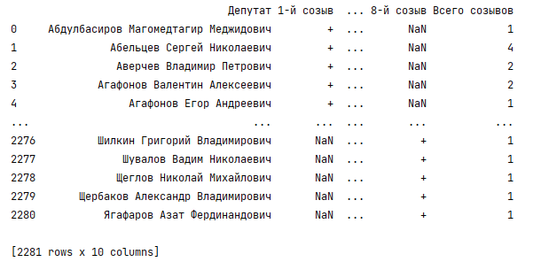
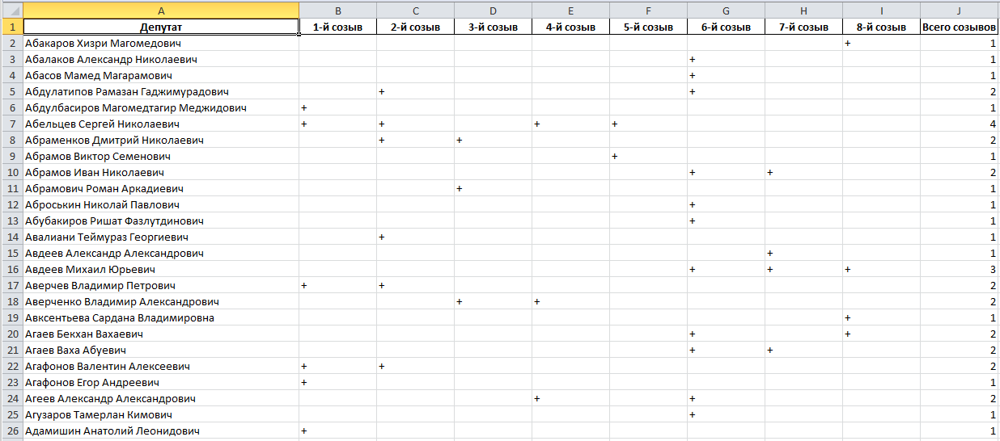

# pandas-example
Example of using Pandas for processing State Duma deputies data (plain Python script with basic optimization, Jupyter Notebook is not used).

Example of processing of one page (contains only one State Duma convocation):

<!--  -->

Example of data statistics from one column (with full names of deputies of all State Duma convocations):

Example of data aggregation by columns (uses a column that is formed as an aggregation of columns for all State Duma convocations):

Example of full dataframe export to Excel file (all State Duma convocations):

